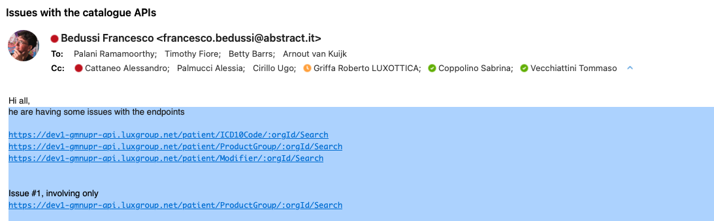

This is a test of the [uhtml](https://github.com/WebReflection/uhtml) library, in the preactive variant.

It simulates a navigation between two pages that share the same state signal.

The state is updated asynchronously to simulate an API call. 

To react to the state updates the page components `render` function must be invoked with a function as the second parameter, as explained [here](https://webreflection.github.io/uhtml/#reactivity).

But in doing so apparently the pages do not unsubscribe from the signal when they are disconnected, so navigating between the pages keeps adding subscriber to the state signal, and the render callback in invoked multiple times, even for disconnected pages:

